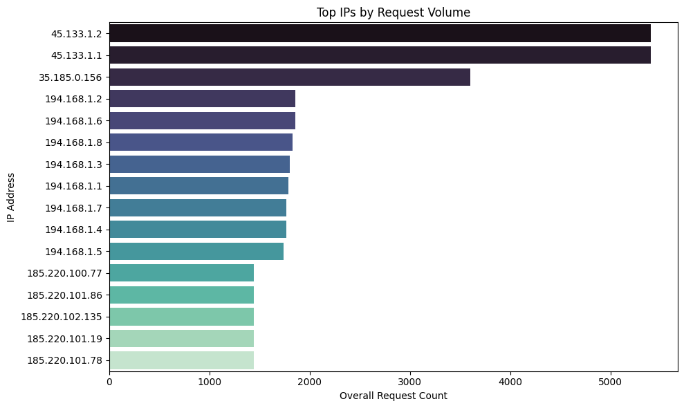

# Investigation of Traffic Surge and Bot Mitigation for Lloyds Project
## Summary of Findings:
### The traffic analysis on the server logs shows a sharp rise in automated or suspicious requests originating from a handful of IP addresses. Three IPs — 45.133.1.2, 45.133.1.1, and 35.185.0.156 — are responsible for over 14,000 requests, accounting for a significant chunk of the traffic. These IPs are associated with non-browser user agents like curl, Wget, python-requests, and known security tools like sqlmap, ZAP, and Burp Suite.
## Approach:
### Firstly, I observed the raw text logging data and then parsed it into array of strings for each logging line. Secondly, I attempted parsing logs using RegEx, however I didn't manage to get desired result and I consulted ChatGPT to find optimal pattern to conveniently store data in a dictionary. After having data stored in a dictionary, I proceeded to use `pandas` to store it in a Data Frame and run Exploratory Data Analysis. As displayed in Observations section of `ieuk-project.ipynb`, I identified 16 suspicious IPs that have over a thousand logs. 
### To eliminate any doubts that these requests could be human, I plotted hourly logging frequency over whole timespan for 16 IPs mentioned earlier: 
### For the last checks, I displayed countries of origin, statuses of requests and types of operations in the **Important observations** section. Although I am not a web developer nor cyber security specialist, using various LLMs and conducting a research I made the following assumptions and recommendations:
### NOTE: The most optimal recommendation is to seek advice from a Cyber Security specialist.
1. **There is clear high frequency and Non-Human Traffic**  
   The IPs generating large volumes of requests (e.g.,`35.185.0.156`) are very likely **bots or automated scripts**, not humans. This is evidenced by:
   - Uniform spike patterns at specific hours.
   - Consistent use of non-browser user agents like `curl`,`Wget`,`sqlmap`, etc.
   - Traffic originating from countries commonly associated with scanning infrastructure or anonymization networks.
    #### **Solution:** Limit the number of requests per IP (e.g., 100/min) using built-in web server or framework features (like NGINX or Flask-Limiter).
2. **Likely Scanning and Probing Activity**  
   A significant portion of the traffic results in status codes like `401`,`403`,`404`. These suggest:
   - Attempts to access non-existent or restricted endpoints(`404`,`403`).
   - Authentication probing or brute-force activity(`401`).
   - Scanners/bots searching for vulnerabilities(`sqlmap`,`nikto` user agents).
    #### **Solution:**   Block Malicious User Agents to known bot tools like `sqlmap`,`curl`, and `python-requests` via user-agent filtering.
3. **Negative impact on Server Health and Load**  
   The server is responding with `500`,`503`,and`504` errors for thousands of requests, indicating:
   - Backend systems are being overwhelmed or throttled.
   - Automated traffic is degrading performance for legitimate users.
    #### **Solution:** Block IPs that generate high request volumes or repeated errors (like `401`,`404`,`429`,`500`). Use simple log analysis or tools like`fail2ban`.
4. **Clear Patterns per IP**
   - Some IPs spike once, suggesting one-time scanning or a failed intrusion attempt.
   - Others show repeated, regular activity, indicating scheduled or persistent automated jobs (possibly from botnets or monitoring scripts).
    #### **Solution:**  Restrict or throttle requests from high-risk regions (e.g., RU) using GeoIP tools.
5. **Insignificant Variation in Legitimate User Agents**  
   Legitimate traffic (browsers like Chrome, Safari, Firefox) makes up the bulk in terms of distinct user agents and shows expected diversity.
   - In contrast, malicious traffic uses a small set of known automation tools, often with default or outdated user agent strings.
    #### **Solution:** CAPTCHA on Critical Endpoints
6. **Likely Use of Automated Exploitation Frameworks**  
   The presence of user agents such as `sqlmap`,`Burp Suite`,`ZAP`,and`nikto` implies that attackers are using well-known security testing tools not for research or compliance but for exploitation or enumeration.
    #### **Solution:** Basic Monitoring
   
